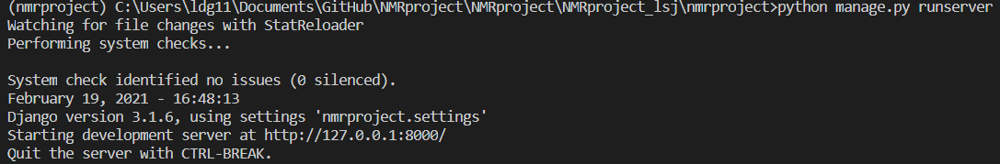

# NMRproject

##### 장고 실행방법

1.  cmd에서 NMRproject_lsj > nmrproject 에 들어간다음, python manage.py runserver라고 입력
</img>

다음과같이 뜨면 성공한거에요!

2. 위의 사진에 나와있는대로, 서버의 주소는 http://127.0.0.1:8000/에 생성되었기에, http://127.0.0.1:8000/를 웹브라우저에 입력후 이동하시면 됩니다.

##### 장고 어드민 사용방법

1. python manage.py createsuperuser 입력후, 슈퍼계정 생성

2. 웹브라우저에서 http://127.0.0.1:8000/admin/ 으로 이동

3. 아까 만든 아이디와 비밀번호로 로그인하시면, 어드민으로 장고 관리 가능